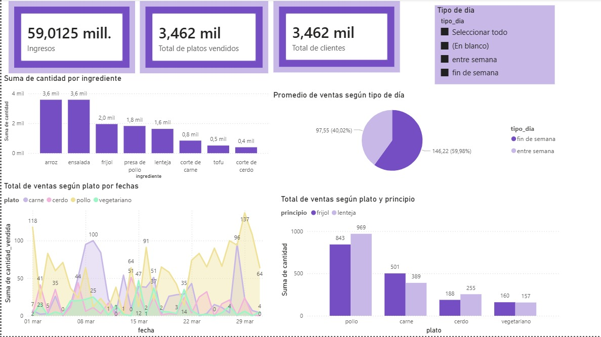

# 🍽️ EcoPlate Optimizer

## 🌱 Descripción
EcoPlate Optimizer es un proyecto de ciencia de datos enfocado en reducir el desperdicio de alimentos en restaurantes mediante modelos predictivos que estiman la demanda diaria.

El sistema permite anticipar cuánta comida preparar, optimizando recursos, reduciendo pérdidas económicas y promoviendo prácticas sostenibles.

## 🚨 Problema

Los restaurantes enfrentan una alta incertidumbre en la demanda:

- Preparar demasiada comida → desperdicio de alimentos  
- Preparar muy poca comida → pérdida de ventas  

En Colombia, los alimentos más desperdiciados incluyen:
- Tomate  
- Papaya  

Esto es especialmente crítico en alimentos perecederos como frutas y vegetales.

## 💡 Solución

EcoPlate Optimizer utiliza datos y modelos predictivos para:

- Predecir el número de clientes diarios  
- Estimar la demanda por tipo de plato  
- Optimizar la producción de alimentos  
- Reducir el desperdicio

## 🧠 Metodología

1. Recolección de datos  
2. Limpieza y análisis exploratorio  
3. Identificación de patrones  
4. Modelado predictivo  
5. Evaluación  

## 📊 Dashboard en Power BI

Vista previa del dashboard desarrollado para el análisis de demanda:

🔗 **Descargar archivo Power BI (.pbix):**  
[Haz clic aquí para descargar](./dashboard.pbix)

